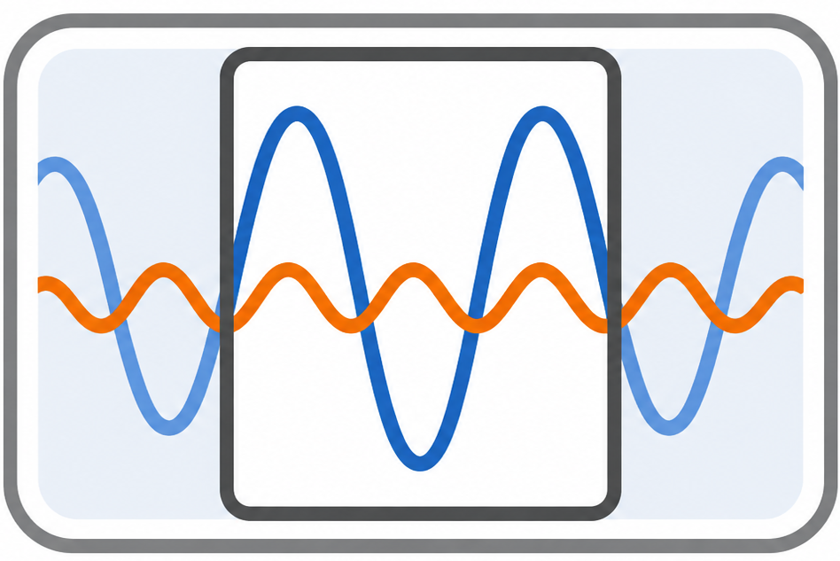
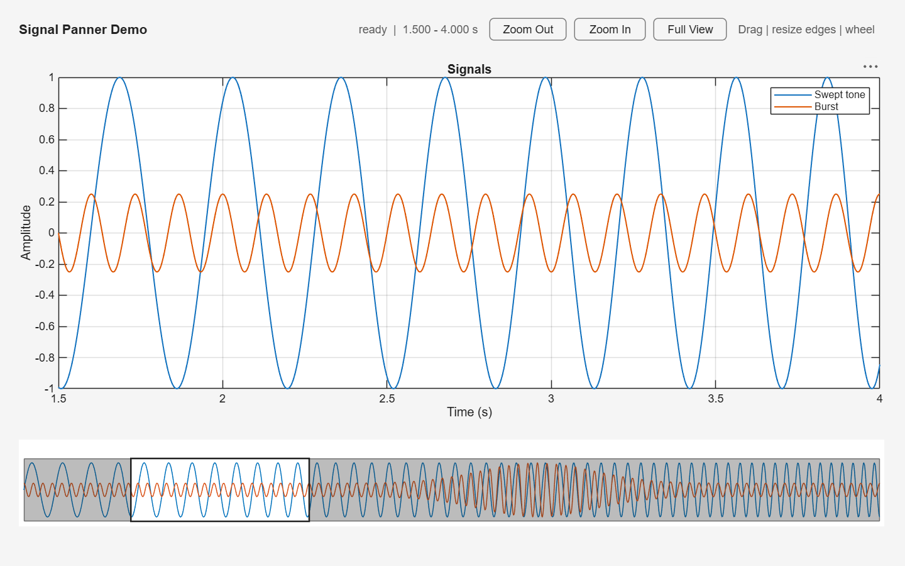

# Signal Panner UI Component
[](https://www.mathworks.com/matlabcentral/fileexchange/FILE_EXCHANGE_ID)
[](https://github.com/mathworks/signal-panner)



Long or densely sampled signals can be difficult to explore: zooming into
detail hides the broader context, while plotting every sample adds graphics
work. `SignalPanner` keeps a full-range overview visible as you navigate and
uses a min/max envelope to cap each signal at `MaxRenderedPoints` overview
vertices while preserving each bin's finite extrema.

The overview spans the full signal range while outlining the interval shown in
a linked axes. Drag the outlined viewport to pan, drag either edge to resize the
visible interval, click a shaded region to recenter, or use the mouse wheel to
zoom.



## Features

- **App Designer integration**: Add the panner as a reusable custom UI
  component.
- **Interactive navigation**: Pan, resize, recenter, and zoom directly in the
  overview.
- **Multiple signals**: Display one or more signal channels with configurable
  colors.
- **Large-data rendering**: Use a min/max envelope to preserve signal peaks
  while limiting the number of rendered points.
- **Live synchronization**: Update a linked axes continuously with
  `ViewChangingFcn`.
- **Completed-change callback**: Respond once after an interaction with
  `ViewChangedFcn`.
- **Programmatic control**: Replace data, pan, zoom, and restore the full view
  from app callbacks.
- **Example app**: Explore two synchronized signals with zoom and full-view
  controls.

## Included Files

- `SignalPanner.mlapp` — reusable App Designer UI component.
- `SignalPanner_demo.mlapp` — example app demonstrating a panner synchronized
  with a signal axes.
- `SignalPannerEventData.m` — event data supplied to component callbacks.

## Setup

1. Download or clone this repository.
2. Add the repository folder to the MATLAB path:

   ```matlab
   addpath("path/to/SignalPanner")
   savepath
   ```

3. If necessary, open `SignalPanner.mlapp` in App Designer and select
   **Configure for Apps**.
4. Restart App Designer if it is already open so that its Component Library
   refreshes.
5. Open or create an app and locate `SignalPanner` under **My Components** in
   the Component Library.

### MathWorks Products

Requires MATLAB R2026a or newer:

- [MATLAB](https://www.mathworks.com/products/matlab.html)

App Designer is included with MATLAB&reg;. No additional MathWorks products or
third-party products are required.

See the
[MATLAB system requirements](https://www.mathworks.com/support/requirements/previous-releases.html)
for supported operating systems.

## Getting Started

### Run the Demo

Open `SignalPanner_demo.mlapp` in App Designer and click **Run**, or launch it
from the MATLAB Command Window:

```matlab
SignalPanner_demo
```

The demo displays two signals and keeps the main signal axes synchronized with
the panner. It also provides controls to zoom in, zoom out, and restore the
full signal interval.

## Examples

### Add the Component to an App

Drag `SignalPanner` from the App Designer Component Library onto the canvas.
App Designer creates a component property such as:

```matlab
app.SignalPanner
```

You can also create the component programmatically:

```matlab
fig = uifigure(Name="Signal Panner");
fig.Position(3:4) = [800 180];

panner = SignalPanner(fig);
panner.Position = [20 40 760 80];
```

The examples below use `panner` for the component. In an App Designer
callback, assign it from the component property:

```matlab
function LoadButtonPushed(app, event)
    panner = app.SignalPanner;

    % Update panner here.
end
```

### Set Signal Data

Provide monotonically increasing coordinates and a signal matrix with one
signal per column:

```matlab
time = linspace(0, 12, 24000).';
signal1 = sin(2*pi*(2.2*time + 0.19*time.^2));
signal2 = 0.6*cos(2*pi*7.5*time);

panner.setData(time, [signal1 signal2]);
panner.ViewLimits = [1.5 4.0];
```

Use `setData` when replacing both arrays with a different number of samples.
You can also set `XData` and `YData` individually when their dimensions remain
compatible.

### Synchronize a Signal Axes

Assign the panner's live callback to update the limits of the main axes:

```matlab
panner.ViewChangingFcn = @(~,event) ...
    xlim(signalAxes, event.ViewLimits);
```

In an App Designer callback, the equivalent code is:

```matlab
% Value changing function: SignalPanner
function SignalPannerViewChanging(app, event)
    app.SignalAxes.XLim = event.ViewLimits;
end
```

Use `ViewChangedFcn` for operations that should run only once after the user
finishes an interaction:

```matlab
function SignalPannerViewChanged(app, event)
    fprintf("%s: [%.3f %.3f]\n", ...
        event.Interaction, event.ViewLimits);
end
```

The callback event data provides:

- `ViewLimits` — newly selected interval.
- `PreviousViewLimits` — interval before the change.
- `Interaction` — `"pan"`, `"resize-left"`, `"resize-right"`,
  `"recenter"`, or `"zoom"`.

### Programmatic Navigation

Shift the selected interval by an x-axis offset:

```matlab
panner.panBy(0.5);
```

Zoom in or out about the current viewport center:

```matlab
panner.zoomBy(0.5);  % Zoom in
panner.zoomBy(2);    % Zoom out
```

Specify a coordinate to keep fixed while zooming:

```matlab
panner.zoomBy(0.5, 3.25);
```

Restore the full data interval:

```matlab
panner.resetView();
```

### Mouse Interaction

| Gesture | Result |
| --- | --- |
| Drag inside the viewport | Pan the selected interval. |
| Drag the left or right edge | Resize the selected interval. |
| Click outside the viewport | Recenter the viewport at the pointer. |
| Scroll the mouse wheel | Zoom about the pointer location. |

Set `InteractionsEnabled` to `false` to disable mouse interaction while
retaining the overview display.

## Public API

### Methods

| Method | Description |
| --- | --- |
| `setData(x,y)` | Replaces coordinates and signal samples atomically. |
| `panBy(delta)` | Shifts the viewport by an x-axis offset. |
| `zoomBy(scaleFactor)` | Zooms about the viewport center. Values below one zoom in. |
| `zoomBy(scaleFactor,center)` | Zooms while keeping the specified coordinate fixed. |
| `resetView()` | Selects the complete data interval. |

### Properties

| Property | Description | Default |
| --- | --- | --- |
| `XData` | Strictly increasing sample coordinates. | Empty |
| `YData` | Signal samples with one signal per column. | Empty |
| `ViewLimits` | Selected interval, or `[NaN NaN]` for the complete interval. | `[NaN NaN]` |
| `DataLimits` | Read-only interval represented by the complete data set. | `[0 1]` |
| `MinimumViewSpan` | Smallest selectable interval; zero selects an automatic minimum. | `0` |
| `MaxRenderedPoints` | Maximum overview vertices rendered per signal. | `5000` |
| `SignalColors` | RGB colors cycled across signal columns. | MATLAB color order |
| `SignalLineWidth` | Width of the overview signal traces. | `0.75` |
| `ShadeColor` | RGB color outside the selected viewport. | `[33 33 33]/255` |
| `ShadeAlpha` | Opacity outside the selected viewport. | `0.30` |
| `ViewportColor` | RGB color of the viewport outline. | `[33 33 33]/255` |
| `ViewportLineWidth` | Width of the viewport outline. | `1.25` |
| `ShowXAxis` | Shows or hides x-axis tick labels. | `false` |
| `InteractionsEnabled` | Enables or disables mouse interaction. | `true` |

### Callbacks

| Callback | Description |
| --- | --- |
| `ViewChangingFcn` | Executes repeatedly while the viewport is changing. |
| `ViewChangedFcn` | Executes once after an interaction completes. |

## License

The license is available in [LICENSE.txt](LICENSE.txt).

Copyright 2026 The MathWorks, Inc.
